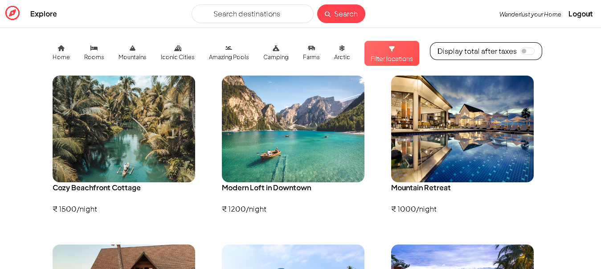
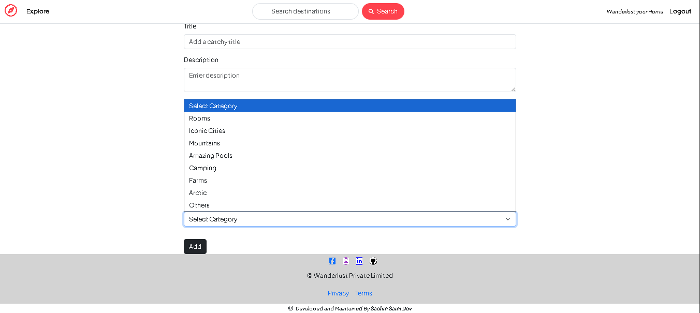
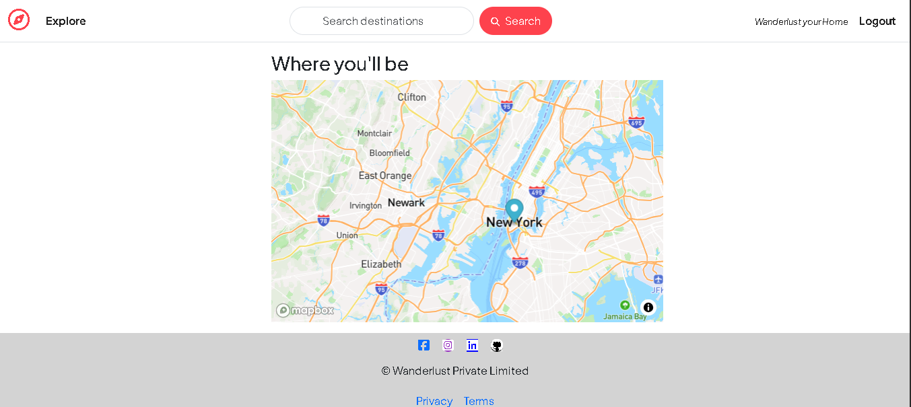

# The Stay Spot – Hotel & Villa Listing & Booking Platform

A full-stack web application to explore, add, and manage hotel and villa listings with search, filters, category views, map integrations, and secure user authentication. Built using the **MERN stack (excluding React)** with **EJS templates** for server-side rendering.

---

## ⚙️ Tech Stack

- **Frontend**: EJS, HTML5, CSS3, Bootstrap 5  
- **Backend**: Node.js, Express.js  
- **Database**: MongoDB with Mongoose  
- **Authentication**: Passport.js (Local Strategy)  
- **File Storage**: Cloudinary (via Multer)  
- **Others**: Mapbox, Flash messages, MVC architecture  

---

## ✨ Features

- 🔐 User registration, login & secure session management  
- 🏠 CRUD operations on hotel/villa listings  
- 💬 Review system (1:N relationship with listings)  
- 🛡️ Authorization & ownership-based access  
- 💥 Flash messages for real-time feedback  
- 🌍 Map integration using Mapbox GL with coordinates  
- 🧼 Cascading delete for associated reviews  
- 💻 Modular MVC code structure  
- 📸 Image upload via Cloudinary  
- 🔎 Search functionality (title, description, price, location, country)  
- 📁 Category-wise filter directly on homepage  
- 🗺️ Geolocation stored in GeoJSON for map visualization  

---

## 🔍 Search & Filter Functionality

- Search listings based on title, location, country, description, or price  
- Filter listings on the homepage by categories like **"Mountains"**, **"Rooms"**, **"Farms"**, etc.  

---

## 🗂️ Folder Structure

```
The Stay Spot/
├── models/          # Mongoose schemas (Listing, Review, User)
├── routes/          # Express route handlers
├── controllers/     # Logic separated from routes
├── views/           # EJS templates
├── public/          # Static assets (CSS, images, screenshots)
├── middleware/      # Custom middleware functions
├── utils/           # Error handling and helpers
├── app.js           # Main Express app
```

---

## 🧑‍💻 How to Run Locally

1. Clone this repository:
   ```
   git clone https://github.com/SachinSaini7/The-Stay-Spot.git
   cd The-Stay-Spot
   ```

2. Install dependencies:
   ```
   npm install
   ```

3. Set up your environment variables (`.env`):
   ```
   DB_URL=<your-mongodb-uri>
   CLOUDINARY_CLOUD_NAME=<your-cloud-name>
   CLOUDINARY_KEY=<your-api-key>
   CLOUDINARY_SECRET=<your-api-secret>
   MAPBOX_TOKEN=<your-mapbox-token>
   SECRET=<your-session-secret>
   ```

4. Run the app:
   ```
   npm start
   ```

---

## 🙋‍♂️ Author

**Sachin Saini**  
[LinkedIn](https://www.linkedin.com/in/sachin-saini-30191024b)  
[GitHub](https://github.com/SachinSaini7)

---

## 📸 Screenshots

### 🔍 Search Bar on Home Page(Navbar Integrated)  


### 🗂️ Category Filtering Schema   


### 📍 Mapbox Integration for Listing Location  


---

## 📜 License

This project is open-source and free to use under the [MIT License](LICENSE).
